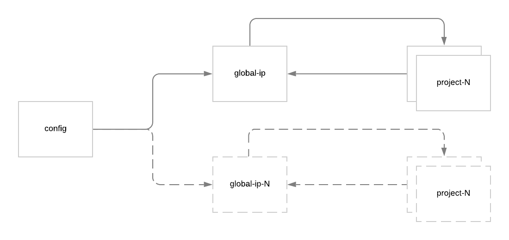

# Terraform Remote State POC

## Workspaces

- `config` = Controls how much state `global-ip` workspaces should manage
- `global-ip` = Creates global IP within the project once project is created
- `project-[N]` = Creates customer projects

## State Dependencies

## Workflow

## One time activity
- `config`: Initialize workspace... code cert, plan/apply to set up initial state
- `global-ip`: Initialize workspace... code cert, plan/apply to set up initial state

### Project Creation 

- `project-[N]`: Create a project... code cert, plan/apply to expose project info 
- `config`: Add an entry... code cert, plan/apply to expose output
- `global-ip`: No code changes... plan/apply to create global IP
- `project-[N]`No code changes... plan/apply to create GLB

### Project Deletion

- `config`: Delete an entry... code cert, plan/apply to remove config
- `global-ip`: No code changes... plan/apply to remove global IP
- `project-[N]`: Remove project info... code cert, plan/apply to remove project
